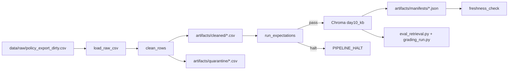

# Kien truc pipeline - Lab Day 10

**Nhom:** Day10 Pipeline Group  
**Cap nhat:** 2026-06-10  
**Run cuoi:** `day10-idempotent-rerun`

## 1. So do luong

`run_id` duoc ghi trong log, manifest, metadata vector va ten file artifact. Freshness duoc do sau buoc publish bang `latest_exported_at` trong manifest. Quarantine giu lai record loi de dieu tra, khong silent drop.

## 2. Ranh gioi trach nhiem

| Thanh phan | Input | Output | Owner |
|------------|-------|--------|-------|
| Ingest | `data/raw/policy_export_dirty.csv` | list row raw | Ingestion Owner |
| Transform | raw rows | cleaned CSV + quarantine CSV | Cleaning Owner |
| Quality | cleaned rows | expectation result + halt decision | Quality Owner |
| Embed | cleaned CSV | Chroma collection `day10_kb` | Embed Owner |
| Monitor | manifest JSON | PASS/WARN/FAIL freshness | Monitoring Owner |

## 3. Idempotency & rerun

Pipeline dung `chunk_id = hash(doc_id, repaired chunk_text, seq)` va Chroma `upsert`. Truoc khi publish, code prune id khong con trong cleaned snapshot de tranh vector cu sau inject. Evidence:

- `day10-final3`: `embed_prune_removed=1` sau khi xoa vector xau tu run inject.
- `day10-idempotent-rerun`: `embed_upsert count=33`, khong con prune; collection giu 33 chunk sach.

## 4. Lien he Day 09

Day 09 agent/RAG chi dung neu corpus da dung version. Pipeline nay publish collection rieng `day10_kb` tu cung domain CS + IT Helpdesk: refund, SLA P1, FAQ IT, HR leave, access control. Neu tich hop lai Day 09, retriever chi can tro collection sang snapshot da publish tu Day 10.

## 5. Rui ro da biet

- Sample export stale: `latest_exported_at=2026-04-11T00:00:00`, freshness FAIL voi SLA 24h la dung.
- Chroma/SentenceTransformer can model cache lan dau; nen tao `.venv` va chay setup truoc demo.
- Raw co source hop le bi thieu trong baseline (`access_control_sop`), nen coverage expectation bat loi neu mat source nay.
- Query P1 escalation dung cum "auto escalate"; transform them alias rat hep de retrieval on dinh hon.
